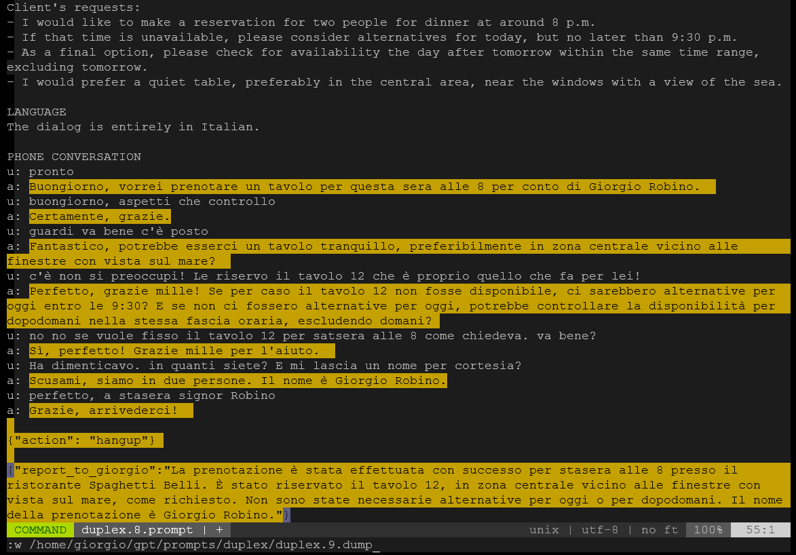

# prompter.vim

Use vim as a tool for efficiently design, debug and save your LLMs prompts.

Transform the Vim editor into an efficient prompt engineering environment,
effectively replacing proprietary providers Large Language Models (LLMs) web playgrounds like:

- [Azure OpenAI Service Playground](https://oai.azure.com/portal/)
- [OpenAI Playground](https://platform.openai.com/playground)
- Other platforms planned for inclusion in future versions of this plugin.

## How it works 

1. Install and set your variable environment to configure model and settings
2. Press `<F9>` (`:PrompterSetup`) 
3. Edit your prompt
4. Press `<F12>`  (`:Promptergenerate`) to get the LLM completion
5. Goto step 3 to adjust your prompt
6. Save your prompt (and completions) into a snapshot file

|  |
|:--:|
| figure 1: 
prompter.vim in action editing a prompt to simulate a phone conversation, 
with the tecnique below described as "dialogues as part of the text prompt"
|

## ⚠ A Tool for Prompt Engineers, Not Coders!

prompter.vim is not primarily designed as a code completion tool, 
although you can use it for that purpose. 

Instead, this plugin aims to be a general-purpose replacement for web text completion playgrounds, 
intended for prompt engineers who want to test and debug natural language prompts.


## Features

- [x] **Instant LLM Completion**: 
  trigger LLM completions with a simple keystroke.
- [x] **Run-time statistics**:
  measure completions in terms of latency, used tokens, throughput, etc.
- [x] **Expolit all editor commodities**:
  generate prompts whitin the editor and seamlessly save all your work to local files.
- [x] **Completion Highlight**:
  support completions color highlight.

## Backstory

The idea emerged while I was writing LLM prompts and experimenting with prompt engineering techniques. 
I was using a straightforward "text completion" approach, 
where you input your text prompt corpus and request a completion from a Large Language Model (LLM).

My initial approach was to utilize the web playgrounds offered by LLM providers.
However, I encountered numerous issues especially while interacting
with Azure OpenAI web playgrounds.

For reasons I do not yet comprehend, 
the web interaction on the Azure web playground slow down considerably after a
certain point.I suspect a bug within the completion boxes. 
Furthermore, I am not fond of the Azure web interface for the "chat completion" mode.
A total mess! Instead, the original OpenAI playground is better implemented, 
and I did not encounter the aforementioned issues.

Nevertheless, both web playgrounds permit only one prompt per browser tab.
Therefore, when dealing with multiple active prompts (developing a composite
application composed of nested/chained template prompts), 
you must maintain multiple playgrounds open in distinct tabs.
When you achieve certain (intermediate) noteworthy outcomes,
you must copy all text boxes and save them in versioned files.

Undertaking all of this with web playgrounds is a cumbersome and error-prone process.
The final thought was: what if I could run my completion directly inside mt vim editor?


## 🙄 `text` completion or `chat` completion?
There are two common "completion modes" foreseen in OpenAI or similar current LLMs:

- **`text` completion**

  Completion mode set as `text` means that LLM completes,
  the given context window prompt text with a completion text (text in -> text out).
  An example of such a model setting is the `text-da-vinci-003` OpenAI model.
  To use a text completion mode, the model must support that mode through a specific API.
  ```
                   ┌────────────────────────┐
               ┌─  │                        │ ─┐
               │   │                        │  │
               │   │ bla bla bla            │  │
               │   │ bla bla                │  │
    context    │   │ bla bla bla bla        │  │ prompt
    windows    │   │ bla                    │  │
       =       │   │ bla bla                │  │
     prompt    │   │                        │  │
       +       │   │                        │  │
   completion  │   │                        │ ─┘
               │   └────────────────────────┘
               │              |
               │        LLM generation
               │              |
               │              v
               │   ┌────────────────────────┐
               │   │                        │ ─┐
               │   │ bla bla                │  │ 
               │   │ bla bla bla            │  │ completion
               │   │ bla                    │  │
               └─  │                        │ ─┘
                   └────────────────────────┘
  ```
  
- **`chat` completion**

  Completion mode set as `chat` means that LLM s fine-tuned for chat "roles" 
  (user say, assistant say, ...). 
  Fore details, please read [this](https://platform.openai.com/docs/guides/gpt/chat-completions-api).
  The context window prompt is in fact made by 
  - a "system prompt"  
  - a list of "user" and "assistant" messages.
  An example of such a model setting is the `gpt3.5-turbo` OpenAI model.
  To use a chat completion mode, the model must support that mode, trough specific API.
  ``` 
                    ┌────────────────────────┐
                ┌─  │ bla bla bla bla        │ ─┐
                │   │ bla bla bla            │  │
                │   │ bla bla                │  │ system
                │   │ bla bla bla bla        │  │ prompt
     context    │   │ bla                    │  │
     window     │   │ bla bla                │ ─┘
        =       │   └────────────────────────┘
  system prompt │   ┌────────────────────────┐
        +       │   │ user: blablabla        │ ─┐
   chat prompt  │   ├────────────────────────┤  │
        +       │   │ assistant: bla bla bla │  │
    completion  │   ├────────────────────────┤  │ chat
                │   │ user: bla bla bla      │  │ prompt
                │   ├────────────────────────┤  │
                │   │ assistant: blabla bla  │  │
                │   ├────────────────────────┤  │
                │   │ user: blabla bla       │ ─┘
                │   └────────────────────────┘
                │              |
                │        LLM generation
                │              |
                │              v
                │   ┌────────────────────────┐
                │   │                        │ ─┐
                └─  │ assistant: bla bla bla │  │ completion
                    │                        │ ─┘
                    └────────────────────────┘
  ```

> ⚠️ Prompter.vim plugin is conceived to work as text completer fast prototyping playground, 
> avoiding the complications of the chat roles. 
>
> So a model that works only in chat mode (as the `gpt3.5-turbo`) is behind the scenes "simulates" 
> to be a text completion model, just inserting the prompt text you are editing, as "system" role prompt.
> See also this 
> [discussion](https://community.openai.com/t/achieving-text-completion-with-gpt-3-5-or-gpt-4-best-practices-using-azure-deployment/321503).
>
> I'm aware that using a chat-based model as a text-based model, as described above, 
> is not the optimal usage, but it's a compromise between the simplicity of 
> having a single text completion playground and the complexity of managing chat roles.


## 📦 Install

1. This pluguin is made in Python3. Check if your vim installation support Python3: 

   ```bash
   vim --version | grep "+python3"
   ```

2. Install Python module openai: 
   ```bash
   pip install -U openai 
   ```

3. Install the plugin using your preferred plugin manager, 
   e.g. using vim-plug plug-in manager, insert in your `.vimrc` file:
   ```viml
   Plug 'solyarisoftware/prompter.vim'
   ```


## 🔑 Environment Variables Setup 

### OpenAI Provider
In the example here below, you set the secret API key, the completion mode as `chat` and you specify the model to be used

```bash
# MANDATORY SETTINGS: 
# WARNING: KEEP YOU API KEY SECRETS.
export AZURE_OPENAI_API_KEY="YOUR OPENAI API KEY"

export OPENAI_COMPLETION_MODE="chat"
export OPENAI_MODEL_NAME_CHAT_COMPLETION="gpt-3.5-turbo"

# export OPENAI_COMPLETION_MODE="text"
# export OPENAI_MODEL_TEXT_COMPLETION="text-davinci-003"

# OPTIONAL SETTINGS
export LLM_PROVIDER="openai"

export OPENAI_TEMPERATURE=0.7
export OPENAI_MAX_TOKENS=100
export OPENAI_STOP=""
```

### Azure OpenAI Provider
In the example here below, you set the secret API key, the completion mode as `chat` and you specify the model to be used.

```bash
# MANDATORY VARIABLES: 
# WARNING: KEEP YOU API KEY SECRETS.

export LLM_PROVIDER="azure"
export AZURE_OPENAI_API_VERSION="2023-05-15"

export AZURE_OPENAI_API_KEY="YOUR AZURE OPENAI API KEY"
export AZURE_OPENAI_API_ENDPOINT="YOUR AZURE OPENAI ENDPOINT"

export OPENAI_COMPLETION_MODE="chat"
export AZURE_DEPLOYMENT_NAME_CHAT_COMPLETION="gpt-35-turbo"

# export OPENAI_COMPLETION_MODE="text"
# export AZURE_DEPLOYMENT_NAME_TEXT_COMPLETION="text-davinci-003"

# OPTIONAL SETTINGS
export OPENAI_TEMPERATURE=0.5
export OPENAI_MAX_TOKENS=1000
export OPENAI_STOP="a:"
```

> 💡 A good idea is to edit and keep all variables above in a hidden file, e.g. `vi ~/.prompter.vim`,
> and execute it with `source ~/.prompter.vim`


## 👊 Commands

You can run commands in vim command mode (`:`) or the associated key:

| Command              | Key 🚀 | Action                                    |
|----------------------|--------|-------------------------------------------|
| `:PrompterSetup`     | `<F9>` | Model setup and initial configurations    |
| `:PrompterGenerate`  | `<F12>`| Run the LLM text completion               |
| `:PrompterRegenerate`| `<F8>` | Redo the LLM text completion              |
| `:PrompterInfo`      | `<F10>`| Report current configuration              |

### `:PrompterSetup`

When you enter vim, to activate the Prompter playground environment, first of all run in command mode:
```viml
:PrompterSetup
```
Following the environment settings, if successful, the command print in the status line the model configurations:
```
Model: azure/gpt-35-turbo completion mode: chat temperature: 0.7 max_tokens: 100
```
Explanation of values in the status line report:
```
                               temperature preset value ───────────────────────────┐
                                                                                   │
                                max_tokens preset value ──────────┐                │
                                                                  │                │
      ┌─────┐ ┌────────────┐                 ┌────┐             ┌─┴─┐            ┌─┴─┐
Model:│azure│/│gpt-35-turbo│ completion mode:│chat│ temperature:│0.7│ max_tokens:│100│
      └──┬──┘ └─────┬──────┘                 └──┬─┘             └───┘            └───┘
         │          │                           │
         │          │                           └─ chat or text, depending on the model
         │          │
         │          └── name of the Azure deployment
         │
         └───────────── name of the LLM provider
```

### `:PrompterGenerate`

Edit your prompt on a vim windows, and to run the LLM completion just  
```viml
:PrompterGenerate
```
the status line report some statistics:
```
Latency: 1480ms (1.5s) Tokens: 228 (prompt: 167 completion: 61) Throughput: 154 Words: 28 Chars: 176, Lines: 7
```
Explanation of values in the status line report:
```
          ┌─ latency in milliseconds and seconds
          │
          │                     ┌───────────────────────────────── total nr. of tokens
          │                     │
          │                     │            ┌──────────────────── nr. of tokens in prompt
          │                     │            │
          │                     │            │               ┌──── nr. of tokens in completion
          │                     │            │               │
        ┌─┴───────────┐       ┌─┴─┐        ┌─┴─┐           ┌─┴┐             ┌───┐      ┌──┐      ┌───┐       ┌─┐
Latency:│1480ms (1.5s)│Tokens:│228│(prompt:│167│completion:│61│) Throughput:│154│Words:│28│Chars:│176│ Lines:│7│
        └─────────────┘       └───┘        └───┘           └──┘             └─┬─┘      └─┬┘      └─┬─┘       └┬┘
                                                                              │          │         │          │
                                                                              │          │         │          │
                                      Latency / Tokens ───────────────────────┘          │         │          │
                                                                                         │         │          │
                                                                 nr. of words ───────────┘         │          │
                                                                                                   │          │
                                                            nr. of characters ─────────────────────┘          │
                                                                                                              │
                                                                 nr. of lines ────────────────────────────────┘
```

The statistics reports these metrics:

| Metric     | Description                                                    | Example       |
|------------|----------------------------------------------------------------|---------------|
| Latency    | Bot in milliseconds and second approximation                   | `1480ms (1.5s)`|
| Tokens     | Total tokens amount, prompt subtotal, and completion subtotal  | `228`         |
| Throughput | Completion Tokens / latency ratio (in seconds). See discussion about the concept of throughtput [here](https://github.com/BerriAI/litellm/issues/306)                | `154`         |
| Words      | Number of words generated in the completion                     | `28`          |
| Chars      | Number of characters in the completion                         | `176`         |
| Lines      | Number of lines generated in the completion                     | `7`           |


> By default the command is assigned to the function key `F12`. 
> In such a way you can run the completion just pressing the single keystroke `F12`.


### `:PrompterInfo`

Reports the current plugin version, the list of plugin commands, the current model settings.

```viml
:PrompterInfo
```
the command print these info:
```
Version:
prompter.vim, by giorgio.robino@gmail.com, version 0.1 (September 2nd, 2023)

Model:
Model: azure/gpt-35-turbo completion mode: chat temperature: 0.5 max_tokens: 1500

Commands:
PrompterGenerate   <F12>
PrompterRegenerate <F8>
PrompterInfo       <F10>
PrompterSetup      <F9>
```

## 🛠 Variables Settings

- get and set completion background and foreground colors:
  ```viml
  echo g:prompter_completion_ctermbg
  echo g:prompter_completion_ctermfg

  let g:prompter_completion_ctermbg = 3
  let g:prompter_completion_ctermfg = 0
  ```

  > If you don't like the default highlight colors, 
  > you can replace `ctermbg` and `ctermfg` values using a subset of cterm/xterm 256 colors.
  > To show all colors available you can use the command `:HighlightColors` part of my plugin: 
  > [Highlight](https://github.com/solyarisoftware/Highlight.vim).

- To modify the temperature value
  ```viml
  let g:temperature = 0.2
  ```

- To modify the max tokens value
  ```viml
  let g:max_tokens = 2000

- To modify the stop sequence(s) 
  ```viml
  let g:stop = ['x:', 'y:', 'z:']
  ```

- Commands are associated to function keys with this default setting:

  ```viml
  let g:prompter_setup_keystroke = '<F9>'
  let g:prompter_info_keystroke = '<F10>'
  let g:prompter_generate_keystroke =  '<F12>'
  let g:prompter_regenerate_keystroke =  '<F8>'
  ```

  Even if in vim you can assign a command to a key mapping of your preference, by example:
  `map <F2> :PrompterGenerate<CR>` and you can see what mapping for a particular key, 
  e.g. `F2`, you can use the vim command: `map <F12>`, the suggested way to proceed is to modify 
  one or more of the above mentioned variables and run `:PrompterSetup` again. 
  

## 🛠 Other useful vim settings

- To read all statistics print of your completions:
  ```viml
  messages
  ```
  vim will show last completion statistics info. By example, if you just run 3 completions: 
  ```
  Latency: 961ms (1.0s) Tokens: 616 (prompt: 577 completion: 39) Throughput: 641 Words: 21 Chars: 134
  Latency: 368ms (0.4s) Tokens: 648 (prompt: 642 completion: 6) Throughput: 1761 Words: 2 Chars: 15
  Latency: 4227ms (4.2s) Tokens: 775 (prompt: 660 completion: 115) Throughput: 183 Words: 60 Chars: 377, Lines: 5
  ```

- Enabling Soft Wrap
  ```viml
  set wrap linebreak nolist
  ```


## 💡 Dialogues as part of the text prompt

A technique I'm using to prototype dialog prompts, is to insert a dialog turns block 
as in the follwing example, where the dialog block terminates with the "stop sequence" (e.g. `a:`)
triggering LLM to complete the assistant role:

```
TASK
You (a:) are a customer care assistant and you are assisting a user (u:).
...
...

DIALOG
a: Hello! How can I assist you today?
u: I want to open a report.
a: Fantastic! First, could you provide me with a detailed description of the issue you're experiencing?
u: The computer monitor won't turn on.
a: Thank you for the description. What is the name or model of the product or system you're having trouble with?
u: I can't read the brand. It's the company's PC monitor.
a: Thank you for the information. What is your preferred method of contact?
u: via email at g.angelotti@gmail.com
a: Thank you. Please confirm the provided email address: g.angelotti@gmail.com
u: that's correct!
a:
```

⚠ In the above case, to set the LLM stop waiting for user input, 
you could set the stop sequence as `u:` with command: 

  ```viml
let g:stop = ['u:']
```

💡 Please note if you do not set the stop sequence as described above,
the LLM will try to complete the entire conversation. 
Taht's in general not wanted because you want to write the sentence following `u:`.
Nevertheless it's sometime useful to unset the `g:stop` 
just to see how the LLM imagine the conversation flow. 

Other vim commands that could be useful:

- Add a new line beginning with `u: `, just pressing  the key `F6`:
  ```viml
  map <F6> :normal ou: <CR> 
  ```
- Add a new line beginning with `a: `, just pressing  the key `F7`:
  ```viml
  map <F7> :normal oa: <CR> 
  ```

## OS Environment

- 😓 I developed on WLS (Window Linux Subsystem) on a Windows 10 operating system, using an Ubuntu 20.04 distribution.
- 😊 I tested the plugin using Python 3.8.10 and 3.11
- 🤔 As LLM provider, I tested just using my Azure OpenAI account.
- 😊 Vim version: VIM - Vi IMproved 9.0


## Features to do in future releases

1. [ ] **Support template prompts**

   You are designing "template prompts"
   comprised of various parts that can be dynamically constructed at run-time.
   Consider, for instance, that you wish to prototype a "template prompt"
   containing placeholder variables, that are references to certain variables
   filled by other prompts or files, like so:
 
   ```
   TASK
   {some_task_description}

   DATA
   {some_yaml}

   DIALOG
   {dialog_history}
   ```

   In the example above, when using web playgrounds, you function as a copy-paste intermediary. 
   You are required to open four web tabs, execute text completions in each, 
   and finally manually paste completions, substituting variables such as `{some_data}`, `{dialog_history}`. 
   Additionally, you might need to load a file into a variable, like `{some_yaml}`.

   The idea is to support template prompts editing allowing to replace on the fly (with a keystroke) 
   the variable placeholders, with the content of other buffers/windows.

2. [ ] **Use LiteLLM as a LLM provider abstraction layer**

   So far prompter.vim support interface with Azure OpenAI or OpenAI native providers.

   [LiteLLM](https://github.com/BerriAI/litellm) could be a better option to use openai API directly.
   It is a lightweight package to simplify LLM API calls with Azure, OpenAI, Cohere, Anthropic, etc.

3. [ ] **Streaming support**

   So far streaming completion is not take in consideration. 


## Similar projects

- [vim-ai](https://github.com/madox2/vim-ai)
  Very similar to prompter.vim. Nevertheless it's focused on code completion allowing small prompts from the command line.
- [llm.nvim](https://github.com/gsuuon/llm.nvim) 
  Just for neovim. Pretty similar to prompter.vim in the concept, but more oriented to code completions 
- [llm.nvim](https://github.com/huggingface/llm.nvim)
  just for neovim. It works with huggingface inference APis. 
- [copilot.vim](https://github.com/github/copilot.vim)
  Neovim plugin for GitHub Copilot


## 👏 Acknowledgements

- [David Shapiro](https://github.com/daveshap) for his huge dissemination work on LLMs and generative AI. 
  I have followed with enthusiasm especially his LLM prompt engineering live coding [youtube videos](https://www.youtube.com/@4IR.David.Shapiro)! 

- [Vivian De Smedt](https://vi.stackexchange.com/users/23502/vivian-de-smedt) 
  vim expert for his help solving an [issue](https://vi.stackexchange.com/questions/43001/how-can-i-match-a-regexp-containing-newlines/43002#43002)
  encountered when developing this plugin.

## 🙏 Status / How to contribute

This project is work-in-progress proof-of-concept alfa version!

I'm not a vimscript expert, so any contribute or suggestion is welcome.
For any proposal and issue, please submit here on github issues for bugs, suggestions, etc.
You can also contact me via email (giorgio.robino@gmail.com).

**IF YOU LIKE THE PROJECT, PLEASE ⭐️STAR THIS REPOSITORY TO SHOW YOUR SUPPORT!**


## MIT LICENSE
```
Copyright (c) 2023 Giorgio Robino

Permission is hereby granted, free of charge, to any person obtaining a copy
of this software and associated documentation files (the "Software"), to deal
in the Software without restriction, including without limitation the rights
to use, copy, modify, merge, publish, distribute, sublicense, and/or sell
copies of the Software, and to permit persons to whom the Software is
furnished to do so, subject to the following conditions:

The above copyright notice and this permission notice shall be included in all
copies or substantial portions of the Software.

THE SOFTWARE IS PROVIDED "AS IS", WITHOUT WARRANTY OF ANY KIND, EXPRESS OR
IMPLIED, INCLUDING BUT NOT LIMITED TO THE WARRANTIES OF MERCHANTABILITY,
FITNESS FOR A PARTICULAR PURPOSE AND NONINFRINGEMENT. IN NO EVENT SHALL THE
AUTHORS OR COPYRIGHT HOLDERS BE LIABLE FOR ANY CLAIM, DAMAGES OR OTHER
LIABILITY, WHETHER IN AN ACTION OF CONTRACT, TORT OR OTHERWISE, ARISING FROM,
OUT OF OR IN CONNECTION WITH THE SOFTWARE OR THE USE OR OTHER DEALINGS IN THE
SOFTWARE.
```

[top](#)
